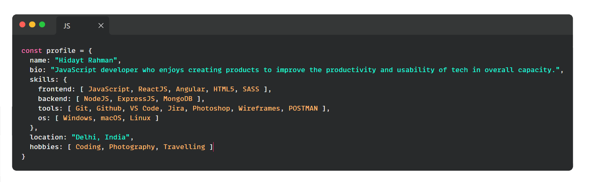

<!--
**hidaytrahman/hidaytrahman** is a ✨ _special_ ✨ repository because its `README.md` (this file) appears on your GitHub profile.

Here are some ideas to get you started:

- 🔭 I’m currently working on ...
- 🌱 I’m currently learning ...
- 👯 I’m looking to collaborate on ...
- 🤔 I’m looking for help with ...
- 💬 Ask me about ...
- 📫 How to reach me: ...
- 😄 Pronouns: ...
- ⚡ Fun fact: ...
-->

<h2>I'm Hidayt Rahman! 👋</h2>

 

<h3>In ♥️ with 👩🏽‍💻 Coding, 📷 <a 
style="color: #fff; border-radius: 5px;margin: 10px 0; display: inline-block" href="https://www.instagram.com/clickimaginehr/" target="_blank">Photography</a> and Travelling  
Specially ! JavaScript (ES6), React, SASS , NodeJS, ExpressJS with MongoDB</h3>

I am a problem solver. I thrive on utilizing my peers’ and my combined experience to produce creative, elegant solutions to difficult problems.

<a 
style="background: #24292e; padding: 5px 15px; color: #fff; border-radius: 5px;margin: 10px 0; display: inline-block"
href="https://hidaytrahman.github.io/">WANT TO KNOW MORE?</a>

 
 

### 🛠 &nbsp;Tech Stack

#### &nbsp; Frontend
&nbsp;
&nbsp;
&nbsp;
&nbsp;
&nbsp;
&nbsp;
&nbsp;

#### &nbsp; Backend
&nbsp;
&nbsp;
&nbsp;

#### &nbsp; Tools
&nbsp;
&nbsp;
&nbsp;
&nbsp;
&nbsp;
&nbsp;
&nbsp;
&nbsp;
&nbsp;
&nbsp;
&nbsp;

#### &nbsp; Other
&nbsp;
&nbsp;
&nbsp;
&nbsp;
&nbsp;
&nbsp;

<h2>Open Source Projects</h2>

  

    
  

  

    
  

   

    
  

   

    
  

 
 
<h2>👀 Stats</h2>

  
  

  <b><em>Overall GitHub Stats:</em></b>  
       

  

  
  

 

 

<h2>📫 How to reach me:</h2>

I'm almost everywhere. 

 Connect me on 
 
- Read Articles on [Medium](https://hidaytrahman.medium.com/)
- Say Hi on [Skype](skype:live:hidaytrahman?cal)
- Also available on [Twitter](https://twitter.com/hidaytrahman) , [StackOverflow](https://stackoverflow.com/users/2927228/hidayt-rahman) , [Instagram](http://instagram.com/hidaytrahman)

